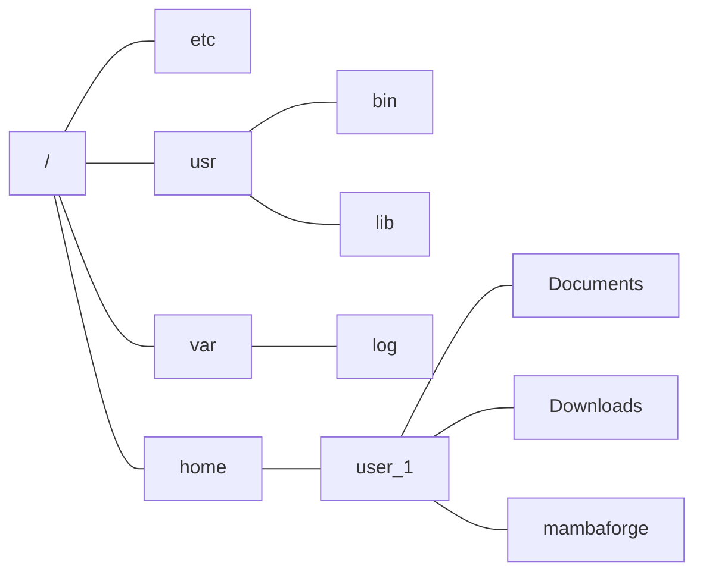
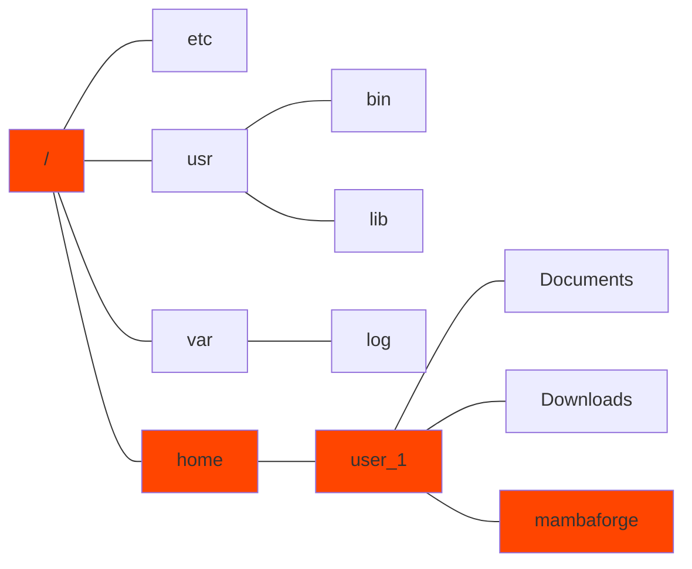
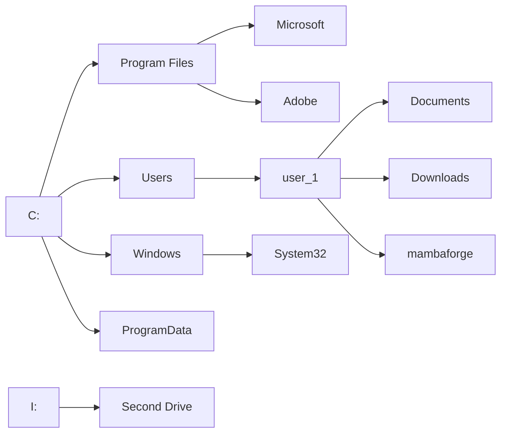
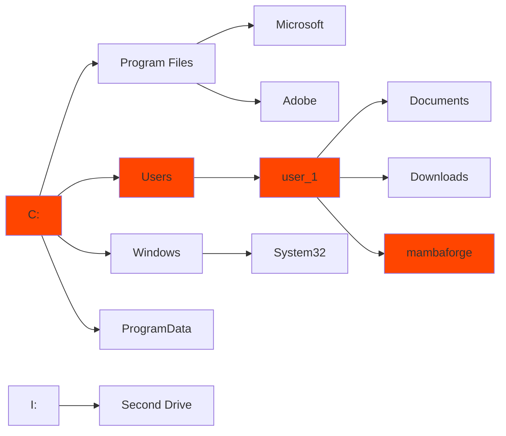

### Effective Programming Practices for Economists

 

# Background

### File Systems

 

Janoś Gabler and Hans-Martin von Gaudecker

---

# Unix File System

---

# Unix File System

### GUI representation

### Shell representation

/home/user_1/mambaforge

---

# Windows File System

 
 

---

# Windows File System

 
 

### GUI representation

### Shell representation

C:\Users\user_1\mambaforge

