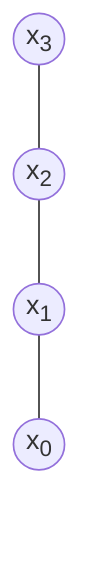
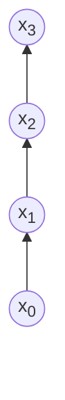
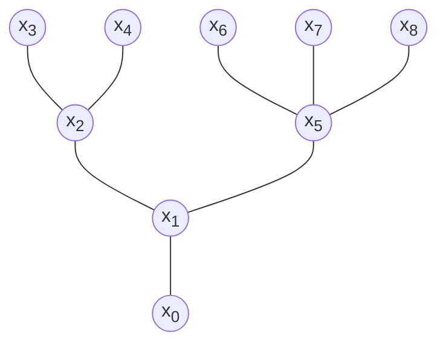
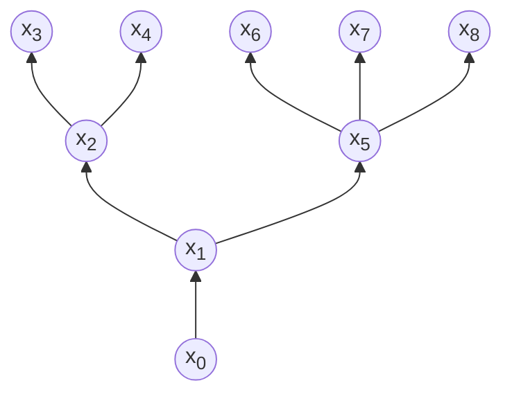
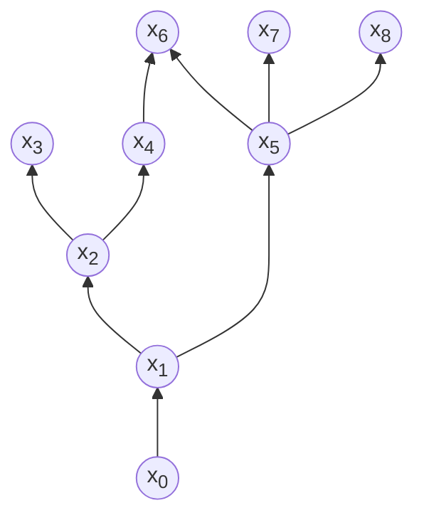
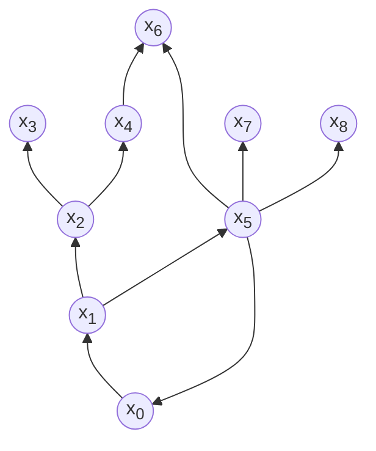

### Effective Programming Practices for Economists

 

# Background

### A Primer on Graphs

 

Janoś Gabler and Hans-Martin von Gaudecker

---

# Graph definition

A graph $G$ is a pair $(N, E)$ of sets, where $N$ are nodes and $E$ are edges:

$$G = (N, E)$$

Edges are
- sets of two nodes (undirected graphs)
- pairs of nodes (directed graphs)

---

# Chain (undirected)

$$
\begin{align*}
N = & \{x_0, x_1, x_2, x_3\} \\[2ex]
E = & \big\{ \\
    & \quad \{x_0, x_1\}, \\
    & \quad \{x_1, x_2\}, \\
    & \quad \{x_2, x_3\} \\
    & \big\}
\end{align*}
$$

---

# Chain (undirected)

$$
\begin{align*}
N = & \{x_0, x_1, x_2, x_3\} \\[2ex]
E = & \big\{ \\
    & \quad \{x_1, x_0\}, \\
    & \quad \{x_1, x_2\}, \\
    & \quad \{x_2, x_3\} \\
    & \big\}
\end{align*}
$$

---

# Chain (directed)

$$
\begin{align*}
N = & \{x_0, x_1, x_2, x_3\} \\[2ex]
E = & \big\{ \\
    & \quad (x_0, x_1), \\
    & \quad (x_1, x_2), \\
    & \quad (x_2, x_3) \\
    & \big\}
\end{align*}
$$

---

# Tree (undirected)

$$
\begin{align*}
N = & \{x_0, x_1, \ldots, x_8\} \\[2ex]
E = & \big\{ \\
    & \quad \{x_0, x_1\}, \{x_1, x_2\},  \{x_2, x_3\}, \\
    & \quad \{x_2, x_4\}, \{x_1, x_5\}, \{x_5, x_6\}, \\
    & \quad \{x_5, x_7\}, \{x_5, x_8\} \\
    & \big\}
\end{align*}
$$

---

# Tree (directed, "arborescence")

$$
\begin{align*}
N = & \{x_0, x_1, \ldots, x_8\} \\[2ex]
E = & \big\{ \\
    & \quad (x_0, x_1), (x_1, x_2),  (x_2, x_3), \\
    & \quad (x_2, x_4), (x_1, x_5), (x_5, x_6), \\
    & \quad (x_5, x_7), (x_5, x_8) \\
    & \big\}
\end{align*}
$$

---

# Directed Acyclic Graph (DAG)

$$
\begin{align*}
N = & \{x_0, x_1, \ldots, x_8\} \\[2ex]
E = & \big\{ \\
    & \quad (x_0, x_1), (x_1, x_2),  (x_2, x_3), \\
    & \quad (x_2, x_4), (x_1, x_5), (x_5, x_6), \\
    & \quad (x_5, x_7), (x_5, x_8), (x_4, x_6) \\
    & \big\}
\end{align*}
$$

---

# Directed ~~Acyclic~~ Graph

$$
\begin{align*}
N = & \{x_0, x_1, \ldots, x_8\} \\[2ex]
E = & \big\{ \\
    & \quad (x_0, x_1), (x_1, x_2),  (x_2, x_3), \\
    & \quad (x_2, x_4), (x_1, x_5), (x_5, x_6), \\
    & \quad (x_5, x_7), (x_5, x_8), (x_4, x_6), \\
    & \quad (x_5, x_0) \\
    & \big\}
\end{align*}
$$

---

# Graph Use Cases

- The file system
- Git
- Reproducible research
- Causal theory
- Behavioural economics
- ...
