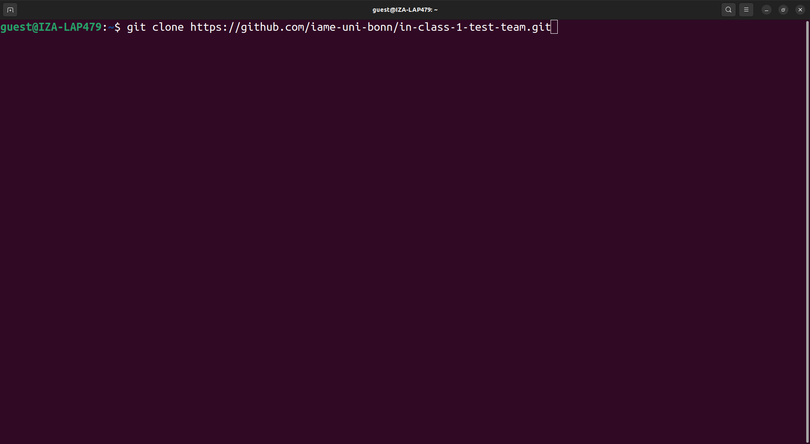

# Cloning GitHub repos + Personal Access Tokens

## Objectives

After reading through this page you will be able to ...

- Clone repositories from GitHub
- Create a GitHub Personal Access Token (PAT)
- Save the PAT in a central location so you do not have to re-enter it any more

## What is cloning?

Cloning a repository means downloading it from GitHub. The cloned repository is linked
to the online repository and can be easily synchronized via commands you will see later.

Cloning is very simple and can be done in a one-line shell command — **except for the
very first time, where you have to create and store a personal access token.**

## How it will work later

First you go to the github page of the repository you want to clone and copy the link
for cloning via HTTPS.


Then you type:

```bash
git clone YOUR_LINK
```



After pressing enter, the repository will be downloaded to your current working
directory in a subdirectory with the same name as the repository.

## How it works the first time

When executing the clone command (1), you will be prompted to enter your user name and
password (2). Even if you enter both correctly, you will get an error message (3).

This is because you have no PAT yet.


To create the PAT, got to [https://github.com/](https://github.com/), click on the
hamburger menu (1) and then on settings (2).


Scroll down and click on "Developer settings".


Click on the following things:

1. "Personal access tokens" (to expand the menu)
1. "Tokens (classic)"
1. "Generate new token"
1. "Generate new token (classic)"


Now you have to pick settings.

1. A name for your personal access token. Choose whatever you want.
1. An expiration date. It is recommended to use a short one (for security reasons) but
   you decide how often you want to create a new token.
1. Check the "repo" checkbox and no other checkboxes.


Scroll all the way down and click on "Generate token".


Copy the token and save it somewhere you will find it again. Do not post screenshots of
the token on the internet, this is like a password. I deleted the token you see on the
screenshot before posting it.


Go back to your shell and do the following:

1. Type `git config --global credential.helper store` and press enter. This will
   seemingly not do anything. However, it means that the password or token that will be
   entered next will be saved.
1. Clone (as described above).
1. Type in your username.
1. **Instead of a password, paste your PAT**.


To make sure that the token was saved and you can from now on clone without entering
your token, you can delete the repo you just cloned (1) and clone again. It should look
as follows:


