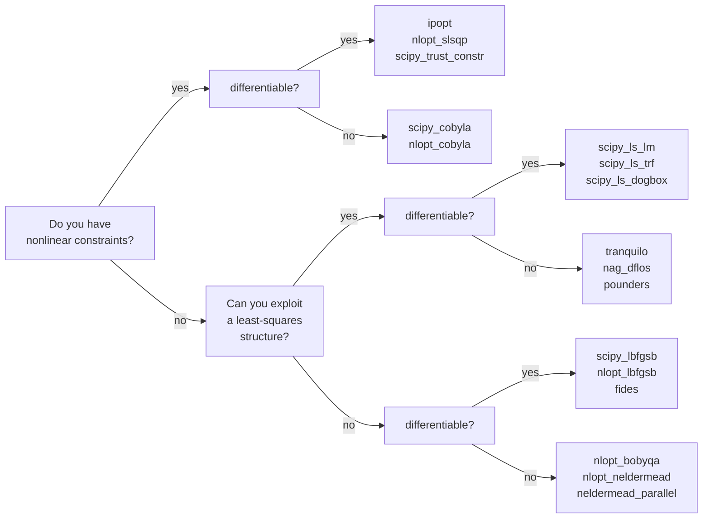
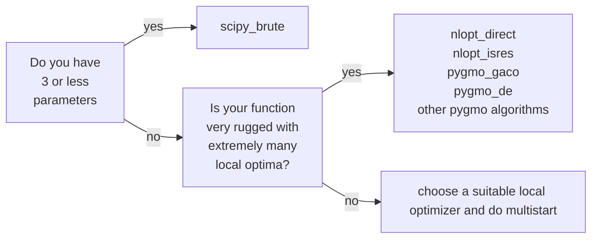

### Effective Programming Practices for Economists

 

# Numerical Optimization

### Choosing optimization algorithms

 

Janoś Gabler and Hans-Martin von Gaudecker

---

# [Steps for choosing an algorithm](https://optimagic.readthedocs.io/en/latest/how_to/how_to_algorithm_selection.html#the-three-steps-for-selecting-algorithms)

 

1. Theory (intro here)

1. Experimentation (histories video)

1. Refine until convergence

---

# Relevant problem properties

- **Smoothness**: Differentiable? Kinks? Discontinuities? Stochastic?

- **Convexity**: Are there local optima?

- **Goal**: If not convex, do you need a global solution? How precise does a solution
  need to be?

- **Size**: 2 parameters? 10? 100? 1,000? Millions? Billions?

- **Constraints**: Bounds? Linear constraints? Nonlinear constraints?

- **Structure**: Nonlinear least-squares, Log-likelihood function

$\rightarrow$ Properties guide selection but experimentation is important

$\rightarrow$ Always compare multiple algorithms in a criterion plot

---

# Try to make your problem simpler

- Get derivatives using automatic differentiation (JAX, pytorch)

- Make your function faster

- Make your function more stable

- Make your function smooth

---

# Choosing local optimizers

Next slide has a practical guide, see [optimagic
docs](https://optimagic.readthedocs.io/en/latest/how_to/how_to_algorithm_selection.html#how-to-select-a-local-optimizer)
for more details.

---

---

# Choosing a global approach

Always refine the result of a global optimizer with a local one
