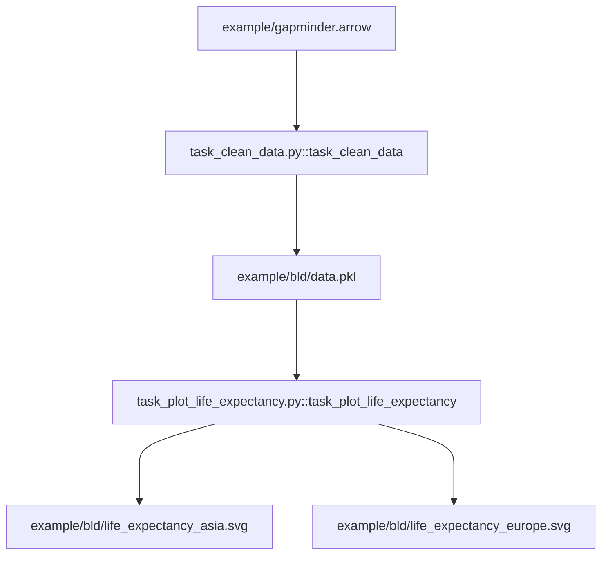
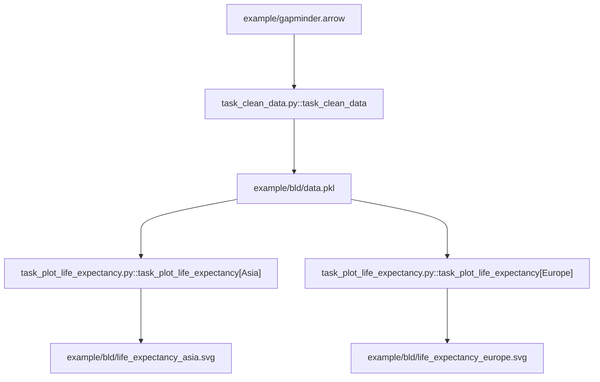

### Effective Programming Practices for Economists

<br>

# Reproducible Research


### Re-using pytask functions

<br>


Janoś Gabler and Hans-Martin von Gaudecker


---


<div class="grid grid-cols-2 gap-4">
<div>

### 1 tasks, 2 products

<br/>




</div>
<div>

### 2 tasks, 1 product each

<br/>



</div>
</div>

---

# Contents of task_plot_life_expectancy.py

```python
BLD = Path(__file__).parent / "bld"

products = {
    "Asia": BLD / "life_expectancy_asia.svg",
    "Europe": BLD / "life_expectancy_europe.svg"
}

def task_plot_life_expectancy(
    data_file=BLD / "data.pkl",
    produces=products,
):
    df = pd.read_pickle(data_file)
    for region, fig_file in produces.items():
        fig = _plot_life_expectancy(df[df["continent"] == region])
        fig.write_image(fig_file)
```

---

# Contents of task_plot_life_expectancy.py

```python
from pytask import task


BLD = Path(__file__).parent / "bld"

for region in ("Asia", "Europe"):

    @task(id=region)
    def task_plot_life_expectancy(
        data_file=BLD / "data.pkl",
        produces=BLD / f"life_expectancy_{region.lower()}.svg",
        region=region,
    ):
        df = pd.read_pickle(data_file)
        fig = _plot_life_expectancy(df[df["continent"] == region])
        fig.write_image(produces)
```

---

# Verify Dependency graph (DAG, tree)


<div class="grid grid-cols-2 gap-4">
<div>

- Inspect function signatures to build a dependency graph
- Tasks for each region appear
- Additional dependency: `region` variable (ignore for now)

</div>
<div>


</div>
</div>


---

# Run pytask


---

# Delete plot and run again


---

# Looping over tasks

- Define your function as usual, but within a loop body
- Set an id based on the running variable(s) via `@task(id=running_var)`
- Set path arguments based on running variable
- Could pass other Python objects, like running variable itself

---

# Looping over tasks or over products?

- Whatever makes your project structure clearer!
- Same style of graphs based on the same dataset: Probably loop over products
- Model specifications: Loop over tasks
- Long running tasks: Loop over tasks
- Looping over tasks yields more granular structure
