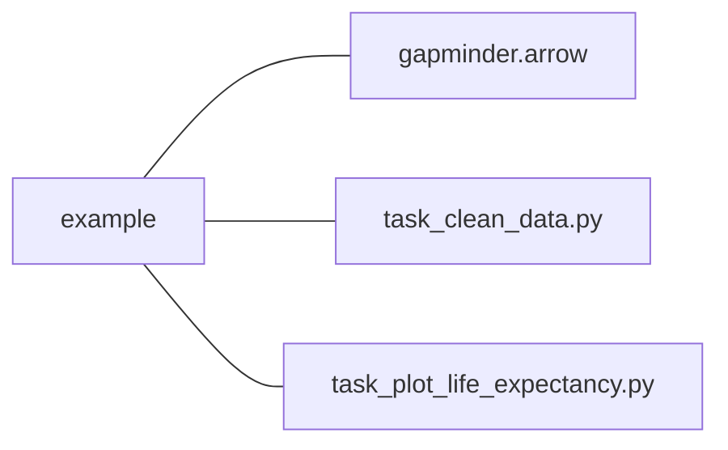
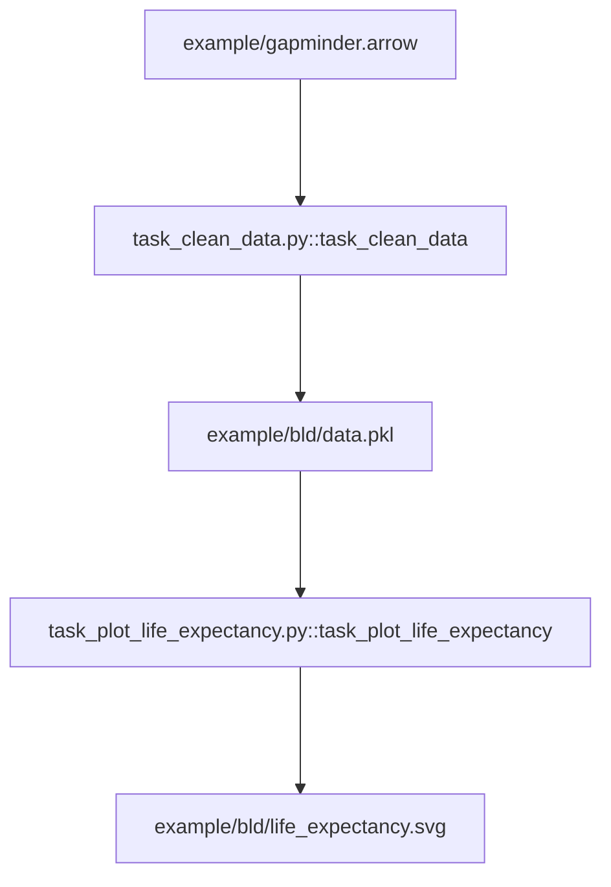

### Effective Programming Practices for Economists

 

# Reproducible Research

### What does pytask do?

 

Janoś Gabler and Hans-Martin von Gaudecker

---

# A tiny example project

- `example/task_clean_data.py`
  - Contains the function `task_clean_data`
  - If called, the function reads in `example/gapminder.arrow` and produces
    `example/bld/data.pkl`
- `example/task_plot_life_expectancy.py`
  - Contains the function `task_plot_life_expectancy`
  - If called, the function reads in `example/bld/data.pkl` and produces
    `example/bld/life_expectancy.svg`

---

# Step 1: collection

 

- Go through all folders in working directory
- Collect all files with name `task_XXX.py`
- Go through those files and collect all functions that start with `task_`
- Task functions and their (default) inputs will be used to construct the workflow

---

# Step 2: Dependency graph (DAG)

- Inspect function signatures to build a dependency graph
- `produces` describes function output
- Other arguments are function dependencies
- DAG structure enables to determine an order of execution that respects dependency
structure (topological sort)

---

# Can you see the DAG?

---

# Step 3: Track changes and execute

- Pytask knows which files should need to be generated
- Also keeps track on when code or products have changed
- Functions are only run if:
    - They have changed
    - A dependency has changed
- Huge time savings in large empirical projects!

---

# Run the first time

---

# Delete plot and run again

---

# Delete cleaned data and run again

