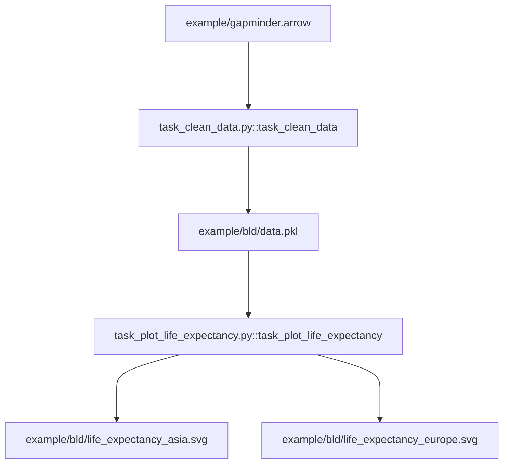

### Effective Programming Practices for Economists

<br>

# Reproducible Research


### Writing (py)tasks with multiple outputs

<br>


Janoś Gabler and Hans-Martin von Gaudecker


---

# Tiny example, extended

<div class="grid grid-cols-2 gap-4">
<div>




</div>
<div>

- How do we tell pytask that we have two products for `task_plot_life_expectancy`?
- How would we tell pytask that we had more than one dependency?
</div>
</div>

---

# Contents of task_clean_data.py

```python
from pathlib import Path

import pandas as pd

BLD = Path(__file__).parent / "bld"


def task_clean_data(raw_file=Path("gapminder.arrow"), produces=BLD / "data.pkl"):
    raw = pd.read_feather(raw_file)
    clean = _clean_data(raw)
    clean.to_pickle(produces)


def _clean_data(raw):
    df = raw.rename(
        columns={
            "lifeExp": "life_exp",
            "gdpPercap": "gdp_per_cap",
        },
    )
    return df
```


---

# Contents of task_plot_life_expectancy.py

```python
BLD = Path(__file__).parent / "bld"

products = {
    "Asia": BLD / "life_expectancy_asia.svg",
    "Europe": BLD / "life_expectancy_europe.svg"
}

def task_plot_life_expectancy(
    data_file=BLD / "data.pkl",
    produces=products,
):
    df = pd.read_pickle(data_file)
    for region, fig_file in produces.items():
        fig = _plot_life_expectancy(df[df["continent"] == region])
        fig.write_image(fig_file)
```

---

# Verify Dependency graph (DAG, tree)


<div class="grid grid-cols-2 gap-4">
<div>

- Inspect function signatures to build a dependency graph
- Both values of `products` dict passed to `produces` argument have become nodes!

</div>
<div>


</div>
</div>


---

# Run pytask


---

# Multiple dependencies and products

- Defaults to keyword arguments may hold
  - a single `pathlib.Path`
  - a container of `pathlib.Path` objects
  - Container may be nested, so long as the atomic elements are `pathlib.Path` objects
- For dependencies, can pass as many different arguments with defaults as you like
