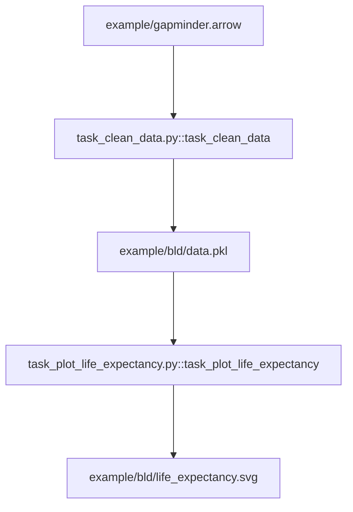

### Effective Programming Practices for Economists

<br>

# Reproducible Research


### Writing simple (py)tasks

<br>


Janoś Gabler and Hans-Martin von Gaudecker


---

# Back to the tiny example

<div class="grid grid-cols-2 gap-4">
<div>




</div>
<div>

- How do we actually write these tasks?
- How do we tell pytask what is a dependency and what is a product?
- Remember:
  - pytask looks for modules called `task_XXX.py``
  - Inside these modules, pytask looks for functions called `task_XXX`
</div>
</div>

---

# Contents of task_clean_data.py

```python
from pathlib import Path

import pandas as pd

BLD = Path(__file__).parent / "bld"


def task_clean_data(raw_file=Path("gapminder.arrow"), produces=BLD / "data.pkl"):
    raw = pd.read_feather(raw_file)
    clean = _clean_data(raw)
    clean.to_pickle(produces)


def _clean_data(raw):
    df = raw.rename(
        columns={
            "lifeExp": "life_exp",
            "gdpPercap": "gdp_per_cap",
        },
    )
    return df.query("continent == 'Asia'")
```


---

# Contents of task_plot_life_expectancy.py

```python
def task_plot_life_expectancy(
    data_file=BLD / "data.pkl",
    produces=BLD / "life_expectancy.svg",
):
    df = pd.read_pickle(data_file)
    fig = _plot_life_expectancy(df)
    fig.write_image(produces)


def _plot_life_expectancy(df):
    return df.plot(
        x="year",
        y="life_exp",
        color="country",
        title="Life Expectancy",
    )
```


---

# Run pytask


---

# Basic rules

- Put tasks in modules called `task_XXX.py`, with functions `task_YYY`
- For these functions, set `pathlib.Path` objects as default arguments:
  - Default of reserved keyword `produces` for products
  - Any other default arguments become dependencies
- Inside these functions, keep structure clear:
  - Read input (usually some data)
  - Execute task (usually in a different function, potentially calling other functions)
  - Write output
