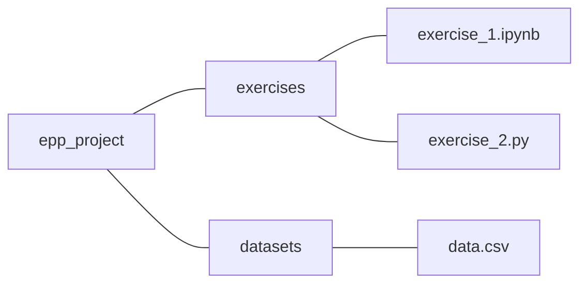

### Effective Programming Practices for Economists

 

# Basic Python

### Executing notebooks in a browser

 

Janoś Gabler and Hans-Martin von Gaudecker

---

# Preparation

- We assume you have installed anaconda and created the course environment
- Open a shell in the root directory of your project
    - On Windows, use the anaconda prompt or the powershell
    - If conda is not recognized in the powershell, check out this [stackoverflow
      post](https://stackoverflow.com/a/65160772/21900143)
- Activate the environment using `conda activate epp`
- Confirm the activation worked using `conda info`
---

# 0. Activate and Info

---

# Example project structure

 

- Our shell is in the `epp_project` directory
- We want to run `exercise_2.ipynb` in the browser
- Command is `jupyter notebook`

---

# 1. Start Notebook

---

# 2. Landing Page

---

# 3. Click on Folder

---

# 4. Work in the Notebook

