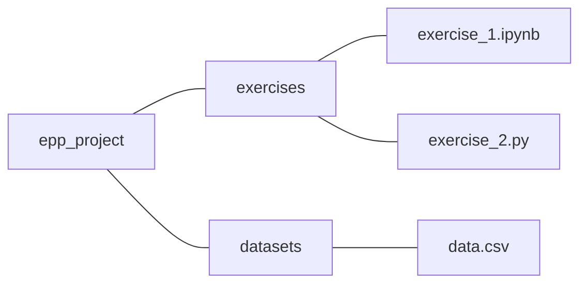

### Effective Programming Practices for Economists

 

# Basic Python

### Executing notebooks in VS Code

 

Janoś Gabler and Hans-Martin von Gaudecker

---

# Preparation

We assume you have:

- Installed anaconda and created the course environment
- Installed VS Code with all relevant Python extensions
- Opened the root directory of your project in VS Code

---

# Example project structure

 

- The entire directory `epp_project` is opened in VS Code
- We want to run `exercise_2.ipynb` in VS Code

---

# 1. Open the file

---

# 2. Command palette (ctrl + shift + p)

---

# 3. Click on "Select another kernel"

---

# 4. Click on "Python environments"

---

# 5. Select the epp environment

---
class: text-xs
---

### Keyboard shortcuts

| Key combination     | Action                           |
| ------------------- | -------------------------------- |
| Ctrl+S              | Save                             |
| ESC                 | Change the cell mode             |
| A                   | Add a cell above                 |
| B                   | Add a cell below                 |
| J or down arrow key | Change a cell to below           |
| K or up arrow key   | Change a cell to above           |
| Ctrl+Enter          | Run the currently selected cell  |
| dd                  | Delete a selected cell           |
| z                   | Undo the last change             |
| M                   | switch the cell type to Markdown |
| Y                   | switch the cell type to code     |
