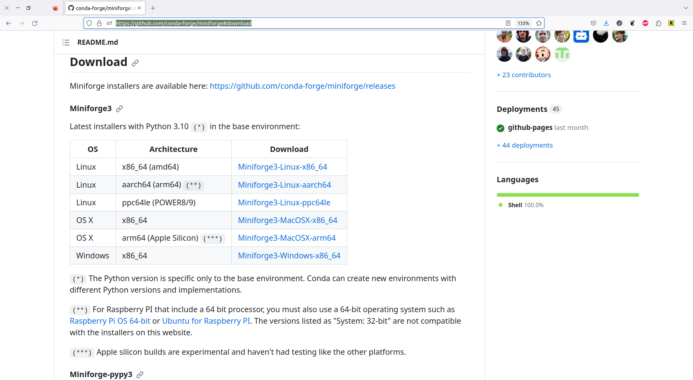
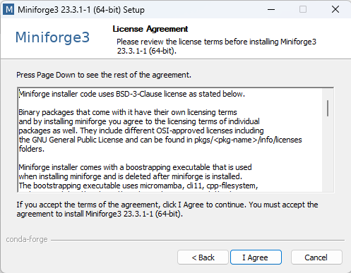
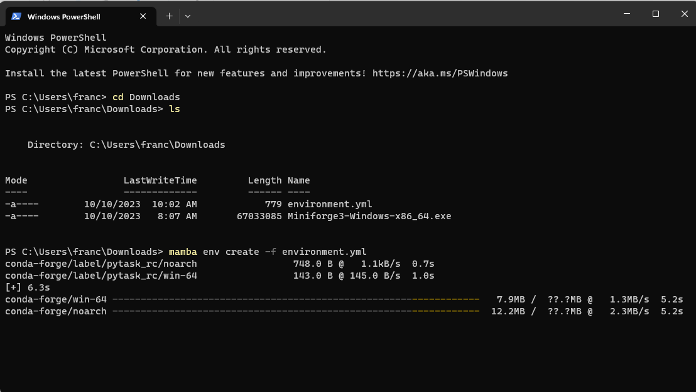
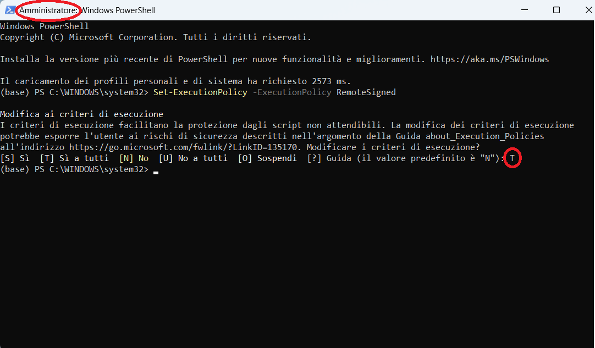
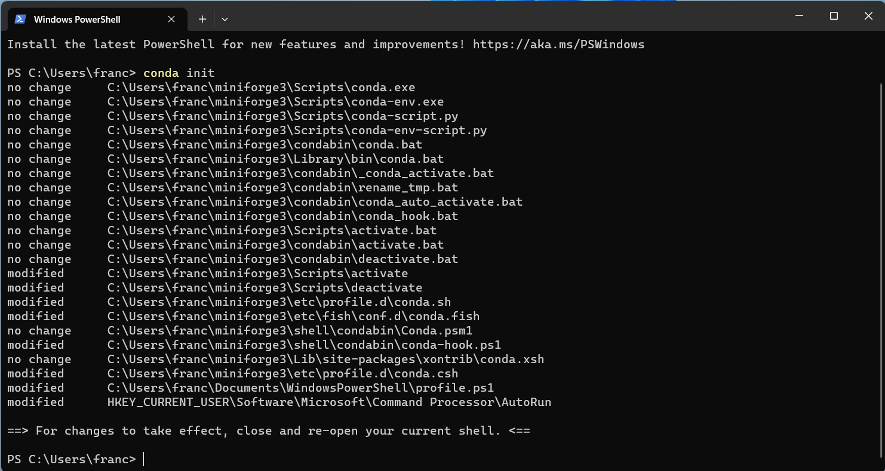

# Installing Python on Windows

There are many different ways to install the Python language and Python packages. Below
we provide one way that works well for everything we need in the class. Please stick
exactly to the instructions unless you know what you are doing and are absolutely sure
you will never need any help from us.

If you have previously installed Python in a different way you can either keep your
installation (if you know what you are doing) or uninstall it and do a fresh install
according to the instructions.

We will cover the following topics:

1. How to install **mamba**: Mamba is a fast package manager that will install the
   everything else. We install it via Miniforge.
1. How to create the **course environment**: The course environment is a collection of
   Python packages that we will need for the course.
1. Troubleshooting: Windows is the most problematic operating system and sometimes
   requires a few extra steps to get everything working.

## Installing mamba

1. Go to
   [https://github.com/conda-forge/miniforge#download](https://github.com/conda-forge/miniforge#download)
   and Download the Windows x86_64 version of the installer in your Downloads folder.

   

1. Navigate to the Downloads folder and double click on the Miniforge3 installer

   

1. In case Microsoft Defender tries to block the installation, click on "Run anyway"

   

1. Then you will have to agree to the terms and conditions and click "Next" several times
   until you get to a radio button. Note that during these steps, you shouldn't change any
   of the default settings.

    
    

1. Once you get to the radio button, select all the options and click on "Install".

   

1. Wait until the installation is complete and finalize it by clicking "Next" and "Finish".

    

1. Before you can use mamba, **you need to restart your terminal!** After the restart you
   can type `mamba info` to quickly check your installation. If it worked, you will see the
   mamba logo.

   

## Creating the course environment

The course environment is a collection of packages that we need for the class. Some of
those packages are not included in the standard anaconda distribution.

Later in the course you will learn many benefits of using virtual environments. Until
then, believe us they are a good idea.

1. You start by downloading the

   ```{eval-rst}
   :download:`course environment <../environment.yml>`
   ```

1. As before, open your Terminal in the directory where you chose to save the course
   environment. You can use `cd` to navigate to a certain directory and `ls` to verify that
   the file is where you expect it to be.

   

1. Execute `mamba env create -f environment.yml`. This will print a lot of things to your
   terminal and take a while. Do not interrupt it or close the terminal.

   

1. When the environment creation is finished, it will give you the commands to activate the
   environment.

   

## Activate the course environment

To check that everything worked, you can activate the environment. **You will have to**
**activate it again each time you start a new Terminal.** More about that later.

You can activate the environment by executing `conda activate ENVIRONMENT_NAME`.
For this course, you will type `conda activate epp`.

The console shows that the environment is active by showing the name of the environment
in parenthesis before the directory you are currently in.


Additionally, if you execute `conda info`, the report will show that the active environemnt is epp


## Troubleshooting 1

If mamba or conda are not recognized as commands in the powershell, do the following:

1. open a Powershell as administrator by right clicking on the powershell icond and selecting
"run as administrator".

1. execute the following command

   ```bash
   Set-ExecutionPolicy -ExecutionPolicy RemoteSigned
   ```

   and select "Yes at all" by entering "T"

   

1. close and re-open Powershell


1. execute

   ```bash
   conda init
   ```

   

1. close and re-open Powershell


Now you can try again the procedure to activate the course environment described above.

## Troubleshooting 2

In case the procedure described in "Troubleshooting 1" above doesn't work and when you
open the powershell an error message pertaining "profile.ps1" appear, you can activate
environments following the procedure described below.
Note that **you will have to follow this procedure each time you start a new Terminal.**

1. To activate the environments in the powershell you need to first switch to the command
   prompt. This is done by typing `cmd` in the terminal.

   

1. Then you can activate the environment by typing `conda activate epp`.
   The console shows that the environment is active by showing the name of the
   environment in parenthesis before the directory you are currently in.

   

1. To prevent the error message pertaining "profile.ps1" to appear every time you
   open a new terminal, you can follow the directory reported in the error message
   and delete "profile.ps1".
