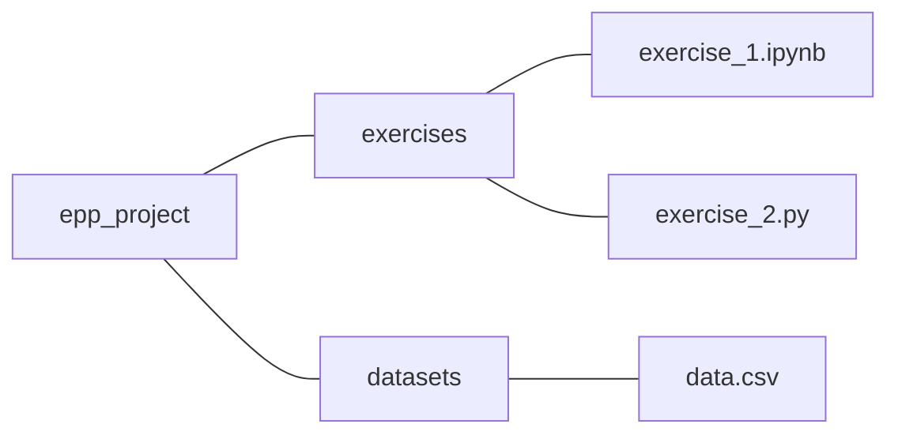

### Effective Programming Practices for Economists

<br/>

# Basic Python

### File paths with pathlib

<br/>


Janoś Gabler and Hans-Martin von Gaudecker

---

# Contents

- How to get a path to the current directory in Python
- Working with pathlib `Path`s
- Rules for working with file paths


---

# Motivation

- There are many ways to work with file paths in Python
- Some are not portable
- We want to give you one way that is guaranteed to work!

---

# An example



<br/>

- `epp_project`, `exercises` and `datasets` are directories
- `exercise_1.ipynb`, `exercise_2.py`, and `data.csv` are files
- Want to load `data.csv` in two different scenarios:
  - from `exercise_1.ipynb`
  - from `exercise_2.py`


---

# How not to do it

```python
import pandas as pd
path = "C:\Users\MyName\epp_project\datasets\data.csv"
data = pd.read_csv(path)
```

<br/>

- This only works on one Computer
- Backslashes (`\`) only work on Windows
- **Warning:** This is what you get when you copy a path from your file explorer

---

# Goal

- Start paths relative to the root folder of the project
- Only make assumptions about directory structure inside the project
- Define the path in a way that is portable across operating systems


---

# Get a path to the project root

### In a notebook

<br/>

The following is in `exercise_1.ipynb`


---

# Get a path to the project root

<div class="grid grid-cols-5 gap-4">
<div class="col-span-3">

```python
from pathlib import Path

# get a path to the current directory
this_dir = Path(".")
print(this_dir)

# make it absolute for readability
this_dir = this_dir.resolve()
print(this_dir)

# move up to epp_project/
root = this_dir.parent
print(root)
```

<br/>

```txt
---
.
/home/janos/Dropbox/epp_project/exercises
/home/janos/Dropbox/epp_project
```

</div>
<div class="col-span-2">

- `Path(".")` gives a relative path to current directory
- `resolve()` makes it absolute for readability
- `.parent` moves up one file/directory
- The output differs on every computer!
- No assumptions made on usernames or folders outside the project

</div>
</div>


---

# Get a path to the project root

### In a `.py` file

<br/>

The following is in `exercise_2.py`

---

# Get a path to the project root

<div class="grid grid-cols-5 gap-4">
<div class="col-span-3">


```python
from pathlib import Path

# get a path to the current file
this_file = Path(__file__)
print(this_file)

# move up to epp_project/
root = this_file.parent.parent
print(root)
```

<br/>

```txt
---

/home/janos/Dropbox/epp_project/exercises/exercise_2.py
/home/janos/Dropbox/epp_project
```

</div>
<div class="col-span-2">

- In a `.py` file `Path()` would lead us to the current directory of the shell from
  which the file was executed
- The `__file__` variable is a magic variable with the path to the current file
- Have to use `.parent` twice!

</div>
</div>


---

# From the project root to the data file

<div class="grid grid-cols-3 gap-4">
<div class="col-span-2">


```python
>>> from pathlib import Path
>>> # .py-file version in one line
>>> root = Path(__file__).parent.parent
>>> print(root)
/home/janos/Dropbox/epp_project

>>> # go to data file
>>> data_path = root / "datasets" / "data.csv"
>>> print(data_path)
/home/janos/Dropbox/epp_project/datasets/data.csv

>>> print(data_path.exists())
True
```

</div>
<div class="col-span-1">

- Once `root` is defined, the rest works the same in notebooks and `.py` files
- Concatenate different path snippets with `/`
- Resulting path works on all platforms!


</div>
</div>


---

# Debugging tips

- Use `path.resolve()` to get full information about your path
- Use `list(path.iterdir())` to list everything in in `path`
- Build up paths one folder at a time and use `path.exists()` to catch typos


---

# File path rules

  1. Always use pathlib `Path` objects instead of strings
  2. Do not hardcode any parts of a path outside of the project's directory
  3. Always concatenate paths with `/`

<br/>

**Remember:**

If you copy paste a path from your Windows File Explorer, all three rules are violated!
