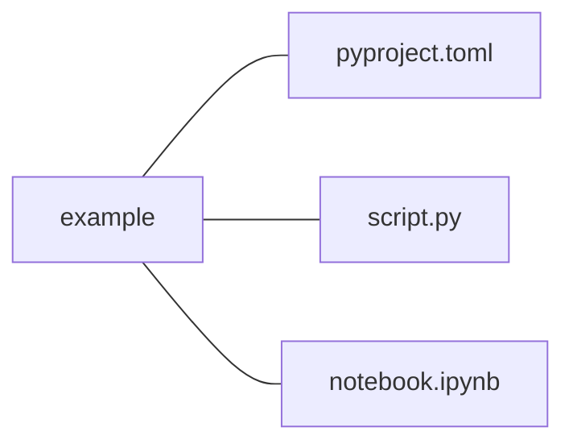

### Effective Programming Practices for Economists

 

# Basic Python

### Executing notebooks in VS Code

 

Janoś Gabler, Hans-Martin von Gaudecker, and Tim Mensinger

---

# Preparation

We assume you have:

- Installed pixi

- Installed VS Code with all relevant Python extensions

- Opened the root directory of your project in VS Code, which contains a
  `pyproject.toml` file installing the `ipykernel` package

- Ran some pixi command and picked the correct Python interpreter in VS Code (see
  previous slide deck)

---

# Example project structure

 

- The entire directory `example` is opened in VS Code
- We want to run `notebook.ipynb` in VS Code

---

# 1. Prerequisites: ipykernel

---

# 2. Prerequisites: Python env picked

---

# 3. Select kernel

---

# 4. Select Python environment

---

# 5. Select Python environment "default"

---

# 6. Run cell via shift + enter

---

# Important

Whenever you come back to the project, you start directly with the last step

---
class: text-sm
---

### Keyboard shortcuts

| Key combination     | Action                                                    |
| ------------------- | --------------------------------------------------------- |
| Ctrl+S              | Save                                                      |
| ESC                 | Change the cell mode                                      |
| A                   | Add a cell above                                          |
| B                   | Add a cell below                                          |
| J or down arrow key | Change a cell to below                                    |
| K or up arrow key   | Change a cell to above                                    |
| Ctrl+Enter          | Run the currently selected cell and stay in that cell     |
| Shift+Enter         | Run the currently selected cell and move to the next cell |
| dd                  | Delete a selected cell                                    |
| z                   | Undo the last change                                      |
| M                   | switch the cell type to Markdown                          |
| Y                   | switch the cell type to code                              |
