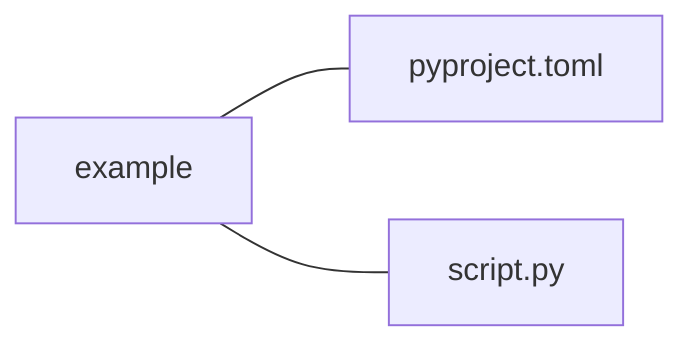

### Effective Programming Practices for Economists

 

# Basic Python

### Executing ".py"-files from VS Code

 

Janoś Gabler, Hans-Martin von Gaudecker, and Tim Mensinger

---

# Preparation

We assume you have:

- Installed pixi

- Installed VS Code with all relevant Python extensions

- Opened the root directory of your project in VS Code, which contains a
  `pyproject.toml` file

---

# Example project structure

 

- We want to run `script.py` in VS Code

---

# 1. Open the file

---

# 2. Command palette (ctrl + shift + p)

Create a new terminal

---

# 3. Type `pixi run python script.py`

---

# 4. .pixi folder with Python exists now

---

# 5. Hard way I: Select Interpreter

Again via command palette (ctrl + shift + p)

---

# 6. Hard way II: Pick "Enter ... path"

---

# 6. Hard way III: Pick "Find..."

---

# 7. Hard way IV: Pick the right one

Located in `.pixi/envs/default/bin/python[version]`

---

# 8. Easier: Close and reopen VS Code

---

# 9. Finally: Run the file

---

# Important

Whenever you come back to the project, you start directly with the last step
