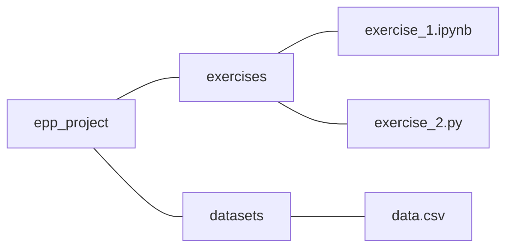

### Effective Programming Practices for Economists

 

# Basic Python

### Executing ".py"-files from VS Code

 

Janoś Gabler and Hans-Martin von Gaudecker

---

# Preparation

We assume you have:
- Installed anaconda and created the course environment
- Installed VS Code with all relevant Python extensions
- Opened the root directory of your project in VS Code

---

# Example project structure

 

- We want to run `exercise_1.py` in VS Code

---

# 1. Open the file

---

# 2. Command palette (ctrl + shift + p)

---

# 3. Select the epp environment

---

# 4. Run the file

