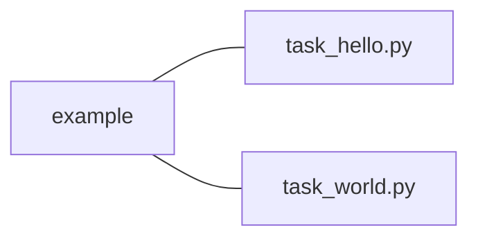

### Effective Programming Practices for Economists

 

# Basic Python

### Running Python code via pytask

 

Janoś Gabler, Hans-Martin von Gaudecker, and Tim Mensinger

---

# Preparation

We assume you have:

- Installed pixi

- Navigated to the root directory of your project in a shell

- Opened the root directory of your project in VS Code, which contains a
  `pyproject.toml` file that includes pytask

---

# How does pytask execute code?

- Executing .py files: Run the entire file
- Executing notebooks: Run individual cells
- Pytask: Run individual functions in multiple .py files

Very useful for automating research pipelines

---

# Example Project Structure

 

- Our shell is in the `example` directory
- We want to run all functions that start with `task_` in both `.py` files
- Command is `pixi run pytask`

---

# 1: Execute

---

# 1: Execute again

