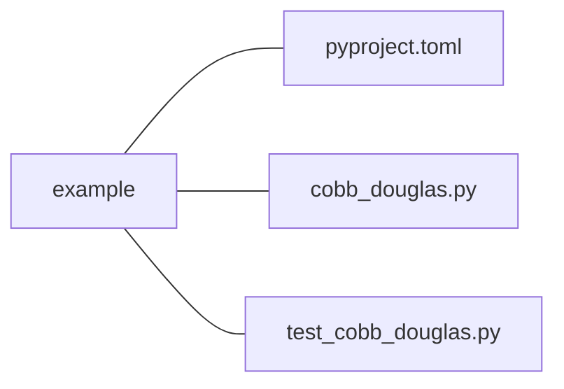

### Effective Programming Practices for Economists

 

# Basic Python

### Running Python code via pytest

 

Janoś Gabler, Hans-Martin von Gaudecker, and Tim Mensinger

---

# Preparation

We assume you have:

- Installed pixi

- Navigated to the root directory of your project in a shell

- The root directory of your contains a `pyproject.toml` file that includes pytest
  and at least one file expected by pytest

---

# How does pytest execute code?

- Executing .py files: Run the entire file
- Executing notebooks: Run individual cells
- Pytest: Run individual functions in multiple .py files

Very useful for automating test execution across an entire project

---

# Example Project Structure

 

- Our shell is in the `example` directory
- We want to run all functions that start with `test_` in `test_cobb_douglas.py`
- Could be spread across multiple test files, across different subdirectories
- Command is `pytest`

---

# Execute

