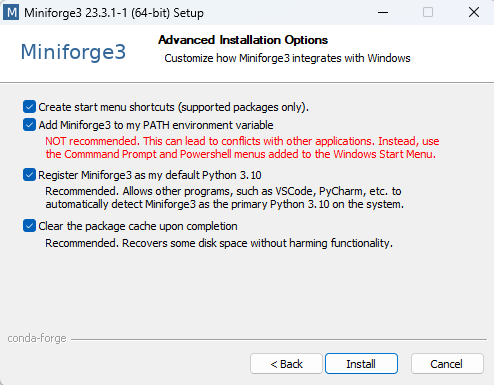

# Installing Python on Windows

There are many different ways to install the Python language and Python packages. Below
we provide one way that works well for everything we need in the class. Please stick
exactly to the instructions unless you know what you are doing and are absolutely sure
you will never need any help from us.

If you have previously installed Python in a different way you can either keep your
installation (if you know what you are doing) or uninstall it and do a fresh install
according to the instructions.

We will cover the following topics:

1. How to install **mamba**: Mamba is a fast package manager that will install the
   everything else. We install it via Miniforge.
1. How to create the **course environment**: The course environment is a collection of
   Python packages that we will need for the course.
1. Troubleshooting: Windows is the most problematic operating system and sometimes
   requires a few extra steps to get everything working.

Finally, if you have worked with Windows before and are not a big fan of the
issues that come with its shell and sometimes with its compatibility with Python, you can
check out the WSL installation guide in this course. This guide
is an alternative to installing Python on Windows, and it will allow you to use a Linux
distribution to run your Python code using a Virtual Machine. We recommend this approach
to those of you who are already a bit "tech-savy" and are familiar with working with
shells and conda environments.

## Installing mamba

1. Go to
   [https://github.com/conda-forge/miniforge#download](https://github.com/conda-forge/miniforge#download)
   and Download the Windows x86_64 version of the installer in your Downloads folder.

   

1. Navigate to the Downloads folder and double click on the Miniforge3 installer

   

1. In case Microsoft Defender tries to block the installation, click on "Run anyway"

   

1. Then you will have to agree to the terms and conditions and click "Next" several times
   until you get to a radio button. Note that during these steps, you shouldn't change any
   of the default settings.

    
    

1. Once you get to the radio button, select all the options and click on "Install".

   

1. Wait until the installation is complete and finalize it by clicking "Next" and "Finish".

    

1. Before you can use mamba, **you need to restart your terminal!** After the restart you
   can type `mamba info` to quickly check your installation. If it worked, you will see the
   mamba logo.

   

## Creating the course environment

The course environment is a collection of packages that we need for the class. Some of
those packages are not included in the standard anaconda distribution.

Later in the course you will learn many benefits of using virtual environments. Until
then, believe us they are a good idea.

1. You start by downloading the

   ```{eval-rst}
   :download:`course environment <../environment.yml>`
   ```

1. As before, open your Terminal in the directory where you chose to save the course
   environment. You can use `cd` to navigate to a certain directory and `ls` to verify that
   the file is where you expect it to be.

   

1. Execute `mamba env create -f environment.yml`. This will print a lot of things to your
   terminal and take a while. Do not interrupt it or close the terminal.

   

1. When the environment creation is finished, it will give you the commands to activate the
   environment.

   

## Activate the course environment

To check that everything worked, you can activate the environment. **You will have to**
**activate it again each time you start a new Terminal.** More about that later.

You can activate the environment by executing `conda activate ENVIRONMENT_NAME`.
For this course, you will type `conda activate epp`.

The console shows that the environment is active by showing the name of the environment
in parenthesis before the directory you are currently in.


Additionally, if you execute `conda info`, the report will show that the active environment is epp


If in the conda info environment you read ```active environment : None```, go to
Troubleshooting 2 below. If you have other problems activating the environment, check
the other Troubleshooting sections.

## Troubleshooting 1

Follow this section's instructions if mamba or conda are not recognized as commands in the
 powershell, and you get the following error:


To fix this you will need to activate conda in the powershell through the conda prompt.

1. First, open the windows search and search for "conda prompt". Open the conda prompt.
   After opening the conda prompt type:
      ```bash
      conda init powershell
      ```

1. After this command finishes running, you can close the Conda prompt, open PowerShell
   (by opening Terminal) and try activating the environment with
   ```conda activate epp_topics``` again, as described above.

## Troubleshooting 2

Another potential issue that may present itself is that, despite no error appearing
after typing ```conda activate epp_topics```, you cannot run .py files, and the
environment does not appear in the terminal (in should appear in parentheses before
PS in the Terminal line).

You can check if this is the issue you are experiencing by typing conda info.


If you get the same output as above, and your active environment reads none as above,
then do the following.

1. Repeat the same steps as in Troubleshooting 1 above.

1. After you are finished, restart your machine.

## Troubleshooting 3

Sometimes there can be problems with the execution policies of Windows. You may get the
following error:


To fix this, we will have to change the execution policy.

1. Open a new terminal as administrator. To open it as administrator you need to right
click on it and select "Open as administrator".

1. Now write
   ```bash
   Set-ExecutionPolicy RemoteSigned
   ```

1. Finally, close the terminal, open a new one, and try activating conda again
(as explained in the previous section).

## Troubleshooting 4

In case non of the previous fixes work and you are still unable to use conda from your
Powershell, you will have to use the command prompt. This is annoying, given that many
navigation commands such as ls and pwd do not work in this type of terminal. However, if
nothing else works this is an easy fix.

Note that **you will have to follow this procedure each time you start a new Terminal.**

1. To activate the environments in the powershell you need to first switch to the command
   prompt. This is done by typing `cmd` in the terminal.

   

1. Then you can activate the environment by typing `conda activate epp`.
   The console shows that the environment is active by showing the name of the
   environment in parenthesis before the directory you are currently in.

   
