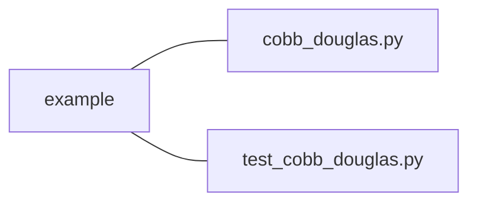

### Effective Programming Practices for Economists

 

# Basic Python

### Running Python code via pytest

 

Janoś Gabler and Hans-Martin von Gaudecker

---

# Preparation

- We assume you have installed anaconda and created the course environment
- Open a shell in the root directory of your project
    - On Windows, use the anaconda prompt or the powershell
    - If conda is not recognized in the powershell, check out this
      [stackoverflow post](https://stackoverflow.com/a/65160772/21900143)
- Activate the environment using `conda activate epp`
- Confirm the activation worked using `conda info`

---

# 0: Activate and Info

---

# How does pytest execute code?

- Executing .py files: Run the entire file
- Executing notebooks: Run individual cells
- Pytest: Run individual functions in multiple .py files

Very useful for automating test execution across an entire project

---

# Example Project Structure

 

- Our shell is in the `example` directory
- We want to run all functions that start with `test_` in `test_cobb_douglas.py`
- Could be spread across multiple test files, across different subdirectories
- Command is `pytest`

---

# 1: Execute

