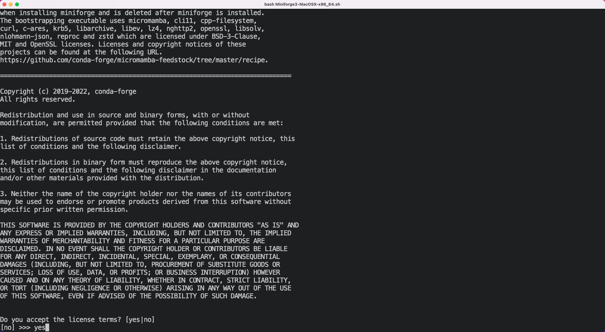
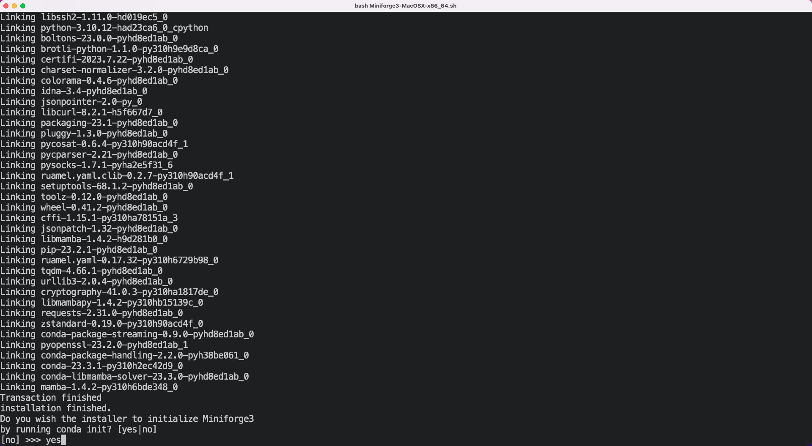
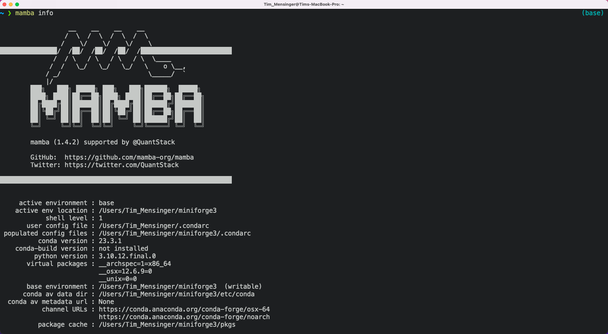
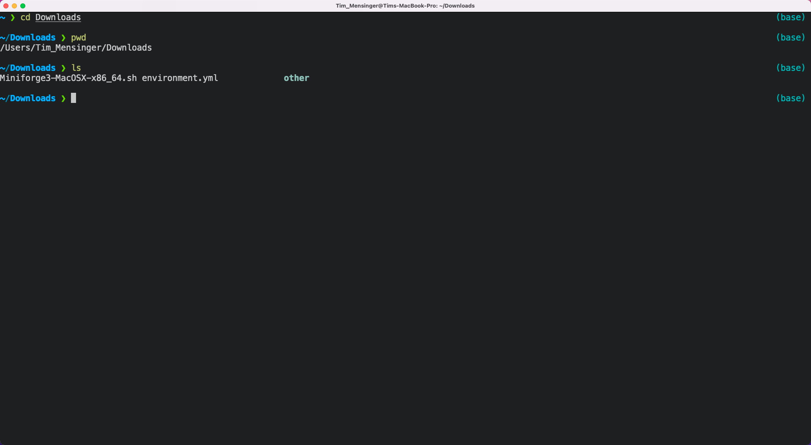
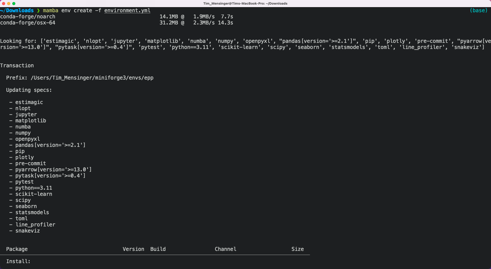
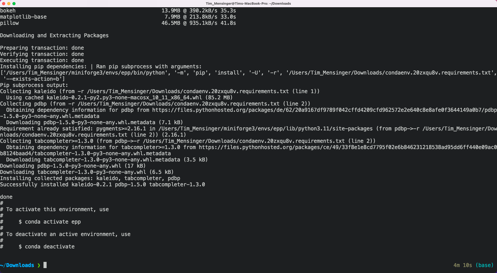

# Installing Python on Mac

There are many different ways to install the Python language and Python packages. Below,
we provide one way that works well for everything we need in the class. Please stick
exactly to the instructions unless you know what you are doing and are absolutely sure
you will never need any help from us.

If you have previously installed Python in a different way you can either keep your
installation (if you know what you are doing) or uninstall it and do a fresh install
according to the instructions.

We will cover the following topics:

1. Detecting whether your computer has an Intel or an Apple processor.
1. How to install **mamba**: Mamba is a fast package manager that will install
   everything else. We install it via miniforge.
1. How to create the **course environment**: The course environment is a collection of
   Python packages that we will need for the course.

## Detecting your processor type

Before continuing you must find out which processor is built into your Mac. You can find
a list of Apple computers that have an Apple processor
[here](https://support.apple.com/en-us/HT211814). If your computer is not on the list,
you have an Intel processor.

## Installing mamba

1. Go to
   [https://github.com/conda-forge/miniforge#download](https://github.com/conda-forge/miniforge#download)
   and download the **OS X x86_64** version (for Intel processors) or the **OS X arm64**
   version (for Apple processors) of the installer in your Downloads folder.

   

1. Open a Terminal in the directory to which you downloaded the installer. You can use
   `pwd` to find out where you are and `ls` to verify that the installer is actually
   there.

   

1. Type `bash Miniforge3-MacOSX-x86_64.sh` (for Intel processors) or
   `bash Miniforge3-MacOSX-arm64.sh` (for Apple processors) and hit enter.

   

1. Then, you will have to hit enter several times more until you get to the license
   agreement. Type `yes` and hit enter again.

   

1. Next, you can choose the location where miniforge should be installed. This should be
   a path with no spaces or special characters in it. As long as your username does not
   contain such characters, you should go with the default.

   

1. Next, you will be asked whether you want to run `conda init`. Type `yes` and hit
   enter.

   

1. After a while, your screen should look like this.

   

1. Before you can use mamba, **you need to restart your terminal!** After the restart,
   you can type `mamba info` to quickly check your installation. If it worked, you will
   see the mamba logo.

   

## Creating the course environment

The course environment is a collection of packages that we need for the class. Some of
those packages are not included in the standard anaconda distribution.

Later in the course, you will learn many benefits of using virtual environments. Until
then, believe us they are a good idea.

You start by downloading the

```{eval-rst}
:download:`course environment <../environment.yml>`
```

1. As before, open your Terminal in the directory where you chose to save the course
   environment. You can use `pwd` to find out where you are and `ls` to verify that the
   file is where you expect it to be.

   

1. Execute `mamba env create -f environment.yml`. This will print a lot of things to
   your terminal and take a while. Do not interrupt it or close the terminal.

   

1. When the environment creation is finished, it will give you the commands to activate
   the environment.

   

1. To check that everything worked, you can activate the environment once. You will have
   to activate it again each time you start a new Terminal. More about that later.

   
