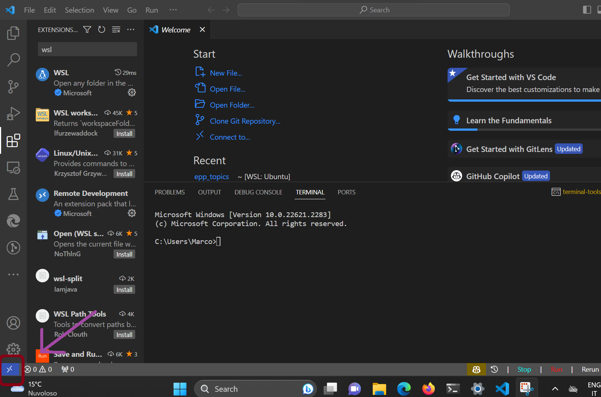
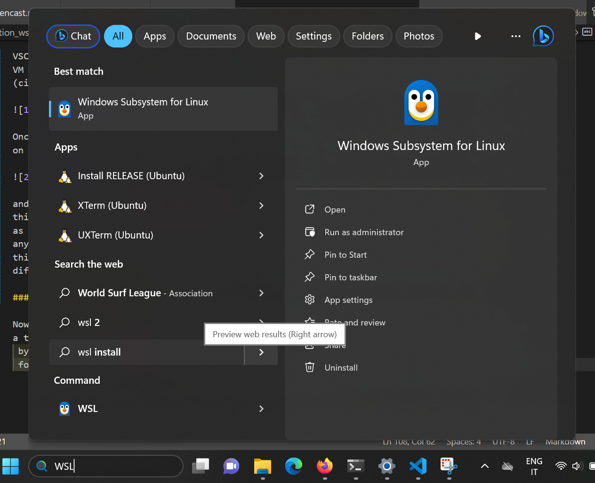

# Installing Python with Windows Subsystem for Linux (WSL2) (conda/mamba)

```{warning}
This page is about the **conda** / **mamba** package manager. Since 2025, we recommend
using **pixi** instead, see the [updated chapter](python-installation-and-execution)
```


## Why this Guide

One way to circumvent the problems with Windows Shell and other issues of compatibility
between Windows and certain Python libraries is to install on Windows a Virtual Machine (VM) for Linux.
Virtual machines are programs that allow you to run a different operating system (OS)
than the one you have installed on your computer.

The easiest way to set up a virtual machine in Windows is to use Windows Subsystem for
Linux (WSL2). This page will guide you through the installation of WSL2 and how to set
up VSCode to use it.

We recommend this approach to those of you who are already familiar with Shells and Linux,
or to those who are willing to learn and use them by putting in some extra effort.
Given potential unexpected complications with Virtual Machines, we may not manage to
provide support to you in all cases, and you will need to be able (and patient enough)
to sort out problems on your own. The upside of doing this will be that you will have
 a Unix-based system like Linux on your Windows installation to run your
programs, which is generally easier and more effective once you get used to it. Linux
tends to have less compatibility issues than Windows with various python libraries;
additionally, having a separate VM for work will allow you to keep your Windows
installation "clean", which can be useful if you use it for other activities (e.g.
video games).

## What is WSL 2
Windows Subsystem for Linux 2 (WSL2) is a new version of the Windows Subsystem for Linux
 architecture that powers the Windows Subsystem for Linux to run ELF64 Linux binaries on
 Windows. Its primary goals are to increase file system performance, as well as adding
 full system call compatibility.

In laymen terms, this means that it is a tool that lets
you install a Linux distribution on your Windows machine, and run programs through it.
The advantage of using WSL2 compared to other virtual machines is that it is very easy
to set up, since it is already built into Windows 10, and it is well integrated with
VSCode. If you are interested in why we recommend WSL rather than other
virtual machines and want to have more info on WSL, you can check [this page](https://learn.microsoft.com/en-us/windows/wsl/faq).

## Installing WSL2

This installation guide is freely adapted from the
[official Microsoft documentation](https://learn.microsoft.com/en-us/windows/wsl/install).
You can also follow that guide directly if you prefer.

### Installing WSL2 on your machine

To install WSL you first need to make sure that you are using Windows 10 or 11. If you
are, then installing WSL is as easy as opening the terminal and typing:

```bash
wsl --install
```
And you will be all set, easy peasy.

### Choosing a Linux Distribution

WSL automatically installs Ubuntu as your Linux distribution. If you want to use a
different distribution, you will have to type:

```bash
wsl --install -d <distribution name>
```

Where `<distribution name>` is the name of the distribution you want to install.
To see a list of available distributions you can type:

```bash
wsl --list --online
```

In general, we recommend you use Ubuntu, especially if you're not very familiar with the
Linux ecosystem. Ubuntu is the most popular Linux distribution, and it is the one that
most people use, so it is the one that is most likely to have support for any kind of
potential issues. If you want to use a different distribution however, some good ones
for VMs are Linux Mint (very lightweight) and Debian.

## Setting up Class Software in WSL2

Now, once you are set with WSL2, you will need to install all the software for this class
on your new VM. If (by chance) you already installed everything on your Windows installation,
beware that this will NOT work in WSL, since it is a different system. You will need to
install everything again.

### Set up VSCode

VSCode is well integrated with WSL2, and it allows you to edit the files you have in your
VM without any particular complication. All you have to do is install the following extension
(circled in red):


Once you have installed it, you can start working inside your Linux installation by clicking
on the bottom-left corner of the screen:



and then clicking on ```Connect to WSL``` in the menu that appears. Once you have done
this, you can navigate folders inside your Linux installation, and open files in VSCode
as you would normally do in Windows (click on open folder for example and navigate to
any directory). You can also open a terminal inside VSCode by clicking on Terminal on the top bar (or using the appropriate shortcut):
this will now open a terminal inside your Linux installation, so do not worry if it looks
different from the Windows terminal.

The default shell for Linux is bash. If you want to use a different shell, you can always
look up other options online. For example, if you want to use zsh, you can follow the
instructions for your distribution [here](https://github.com/ohmyzsh/ohmyzsh/wiki/Installing-ZSH).

### Installing Python

Now that you have set up VSCode, you can install Python. To do so, you will need to open
a terminal of your linux installation. You can do this either through VSCode, as explained,
 by simply running ```wsl``` in the Windows terminal, or (my favorite option) by searching
 for WSL in the Windows search bar and clicking on the result (the penguin in the picture
 below).



Once you have opened the terminal, we will need to use it to install mamba (the
downloaded distribution containing it is called Miniforge). First, you need to know
whether you have an ARM64 or an x86_64 processor. To do so, you will either need to
check what processor you have or to run the following command in the terminal:

```bash
uname -m
```

If you have a x86_64 processor, you will see `x86_64` in the output. If you have
this processor, you can download Miniforge by running the following command:

```bash
wget https://github.com/conda-forge/miniforge/releases/latest/download/Miniforge3-Linux-x86_64.sh
```

If you have an ARM64 processor, you will see `aarch64` in the output. If you have this
just run:

```bash
wget https://github.com/conda-forge/miniforge/releases/latest/download/Miniforge3-Linux-aarch64.sh
```

If you have problems running wget it may be because you do not have it installed in your
system. To install it, just run:

```bash
sudo apt install wget
```

and insert your password when prompted.

Once the download is completed, you will need to install the file you just downloaded. To
do this, be in the same directory in which you downloaded it, and run:

```bash
bash Miniforge3-Linux-x86_64.sh
```

if you have an x86_64 processor, or

```bash
bash Miniforge3-Linux-aarch64.sh
```

if you have an ARM64 processor.

Accept the terms of the installation by following the instructions on the screen, and
once you are finished, check the installation by typing:

```bash
conda init
conda activate
```

### Installing Git (Optional)

Git installation is covered in a different part of this course. However, since you will
need to use the terminal to install it in WSL, we want to help you start this by simply
having you install the Git software. To do so, just run:

```bash
sudo apt install git
```

After the installation there are a few more steps that you will need to run Git, which
you can check in our Git section in this website. Git comes pre-installed on some Linux
distributions, so you may not need to install it (it will tell you if it is already
installed when you run the command above).

### Troubleshooting

If you have any problems with the installation, please contact us on Zulip.
Please let us know of your issues even if you manage to fix them so that we may add it
to this section for future students!
