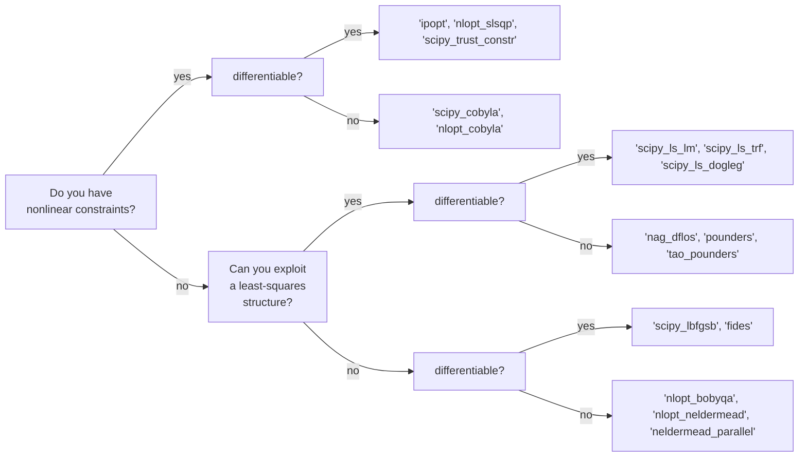
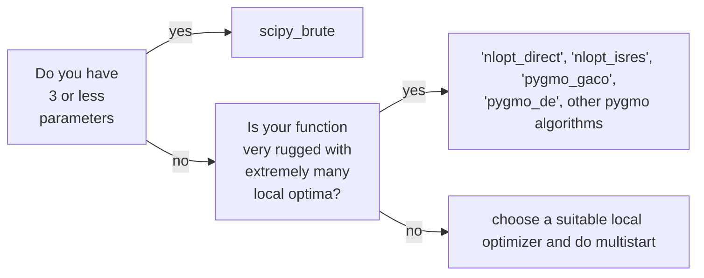

### Effective Programming Practices for Economists

 

# Scientific Computing

### Choosing optimization algorithms

 

Janoś Gabler and Hans-Martin von Gaudecker

---

# Relevant problem properties

- **Smoothness**: Differentiable? Kinks? Discontinuities? Stochastic?
- **Convexity**: Are there local optima?
- **Goal**: Do you need a global solution? How precise?
- **Size**: 2 parameters? 10? 100? 1000? More?
- **Constraints**: Bounds? Linear constraints? Nonlinear constraints?
- **Structure**: Nonlinear least-squares, Log-likelihood function

$\rightarrow$ Properties guide selection but experimentation is important
$\rightarrow$ Always compare multiple algorithms in a criterion plot

---

# Try to make your problem simpler

- Get derivatives using automatic differentiation (JAX, pytorch)
- Make your function faster
- Make your function more stable
- Try to make your function smooth

---

# Choosing local optimizers

---

# Choosing a global approach

Always refine the result of a global optimizer with a local one
