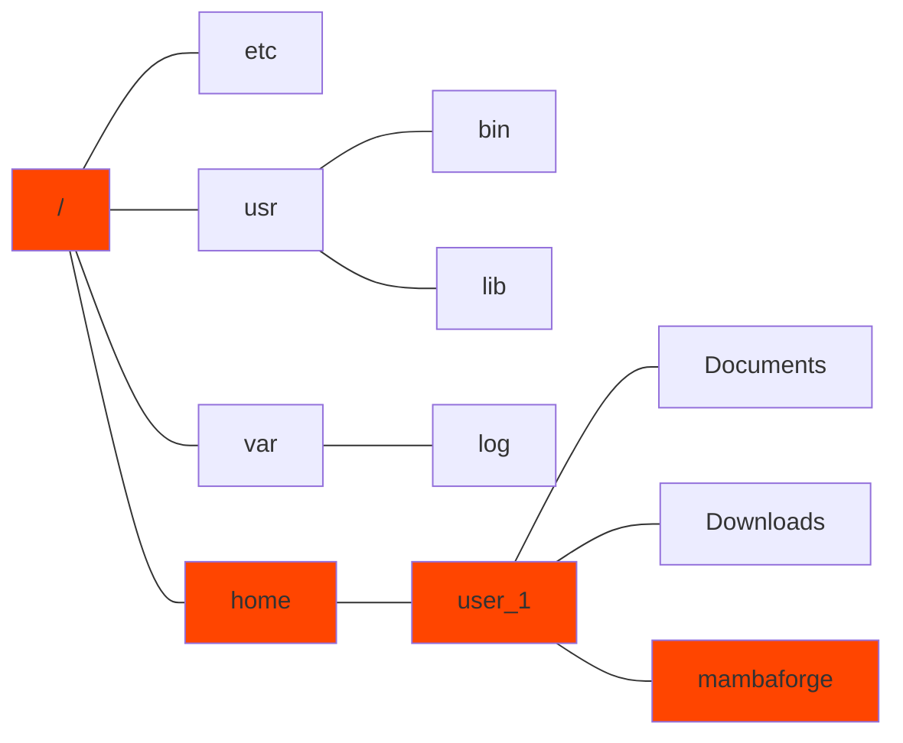
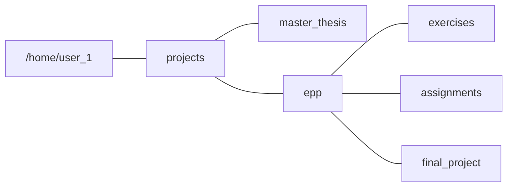

### Effective Programming Practices for Economists

 

# Miscellaneous Tools

### Navigation in the Unix shell

 

Janoś Gabler and Hans-Martin von Gaudecker

---

# Motivation

- Your shell has a present-working-directory (pwd)
- By default, the home directory
- Typically, you want the pwd to be your project folder
  - Can use right click in your file explorer (inefficient)
  - Can use `cd`
- Optionally, you can also create, copy and delete files in the shell

---

# Unix File System

### GUI representation

### Shell representation

/home/user_1/mambaforge

---

# Where to store your projects

- Good idea to store all git repositories somewhere close to home directory
- Example:

---

# The z command

- Only type rough names of files to jump to them
- Similar to fuzzy matching in VS Code!
- Gets better the more you use it!
- Installation: https://github.com/rupa/z
