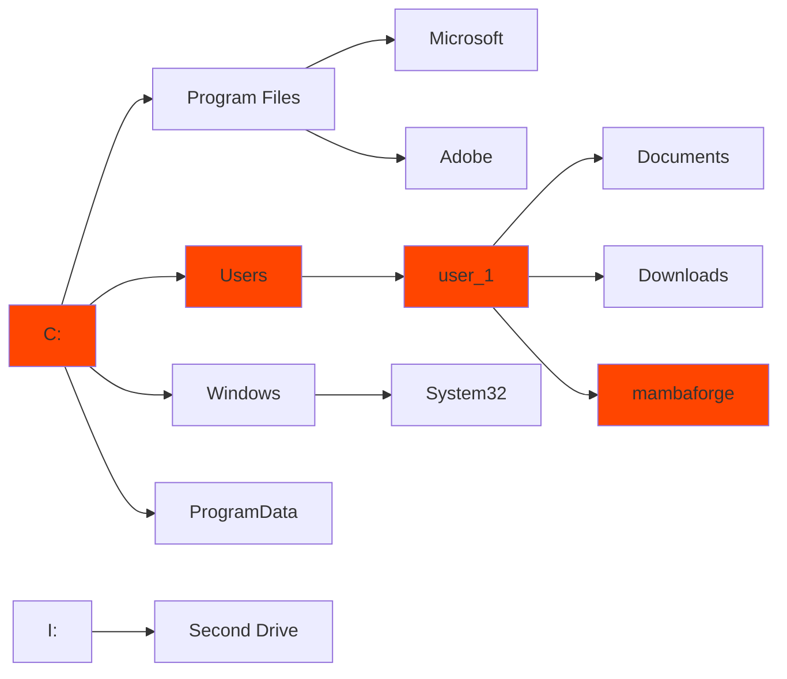
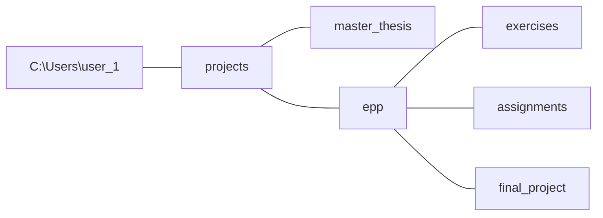

### Effective Programming Practices for Economists

 

# Miscellaneous Tools

### Navigation in the Windows shell

 

Janoś Gabler and Hans-Martin von Gaudecker

---

# Motivation

- Your shell has a present-working-directory (pwd)
- By default, the home directory
- Typically, you want the pwd to be your project folder
  - Can use right click in your file explorer (inefficient)
  - Can use `cd`
- Optionally, you can also create, copy and delete files in the shell

---

# Windows File System

 
 

### GUI representation

### Shell representation

C:\Users\user_1\mambaforge

---

# Where to store your projects

- Good idea to store all git repositories somewhere close to home directory
- Example:

